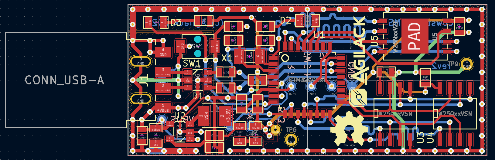
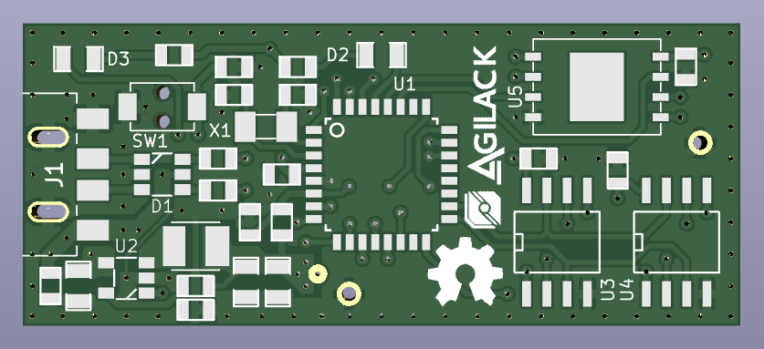
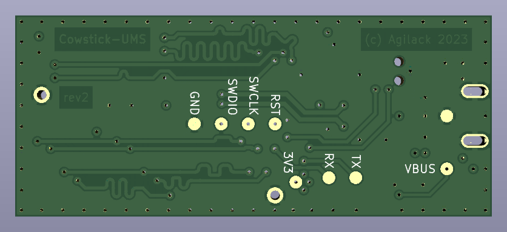
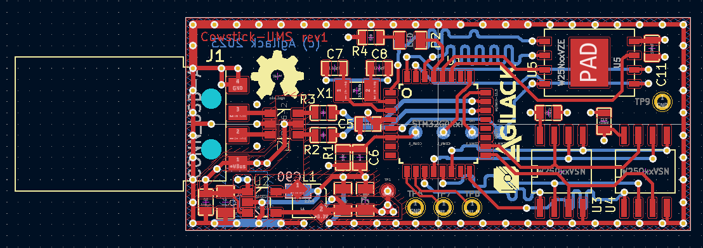
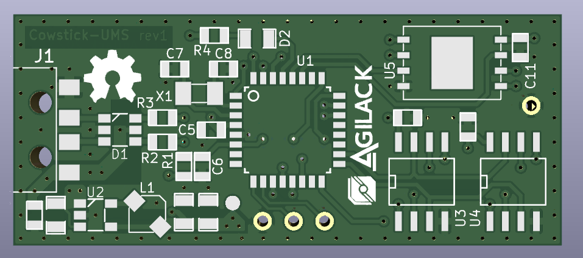
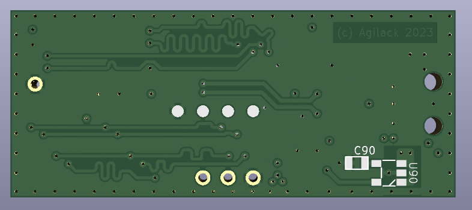

Cowstick UMS - Hardware
=======================

A new revision (rev2) have been designed and is currently in production.

<table>
<tr>
<td></td>
<td></td>
</tr><tr>
<td>Fig1: 3D view of the top side</td>
<td>Fig2: 3D view of the bottom side</td>
</tr>
</table>

Revision 1
----------

Below pictures of the first revision of the board. Everything works and
can still been used.

<table>
<tr>
<td></td>
<td></td>
</tr><tr>
<td>Fig1: 3D view of the top side</td>
<td>Fig2: 3D view of the bottom side</td>
</tr>
</table>
