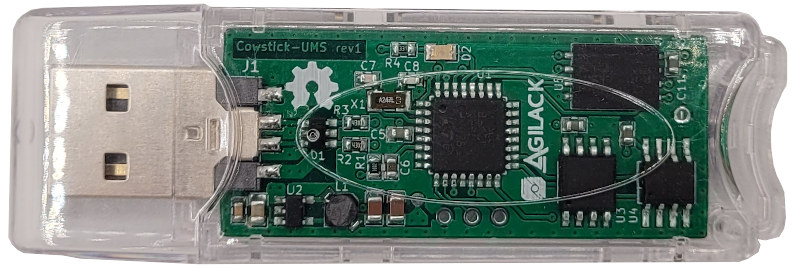

Cowstick UMS - Hardware
=======================

A new revision (rev2) have been designed to include some improvements.

List of changes since previous version :
 - Modify power supply to use another regulator ic (see [test_mt3410.md](test_mt3410.md) )
 - Remove the alternative power supply (LDO, never used)
 - Add a second LED indicator and a user push-button
 - Modify the USB connector (for test)

<table>
<tr>
<td></td>
<td></td>
</tr><tr>
<td>Fig1: 3D view of the top side</td>
<td>Fig2: 3D view of the bottom side</td>
</tr>
</table>

Revision 1
----------

Below pictures of the first revision of the board. Everything works fine, this
revision can still been used.

<table>
<tr>
<td></td>
<td></td>
</tr><tr>
<td>Fig3: cowstick-ums revision 1</td>
<td>Fig4: Preview of rev1 routing</td>
</tr>
<tr>
<td></td>
<td></td>
</tr><tr>
<td>Fig5: 3D view of the top side</td>
<td>Fig6: 3D view of the bottom side</td>
</tr>
</table>
