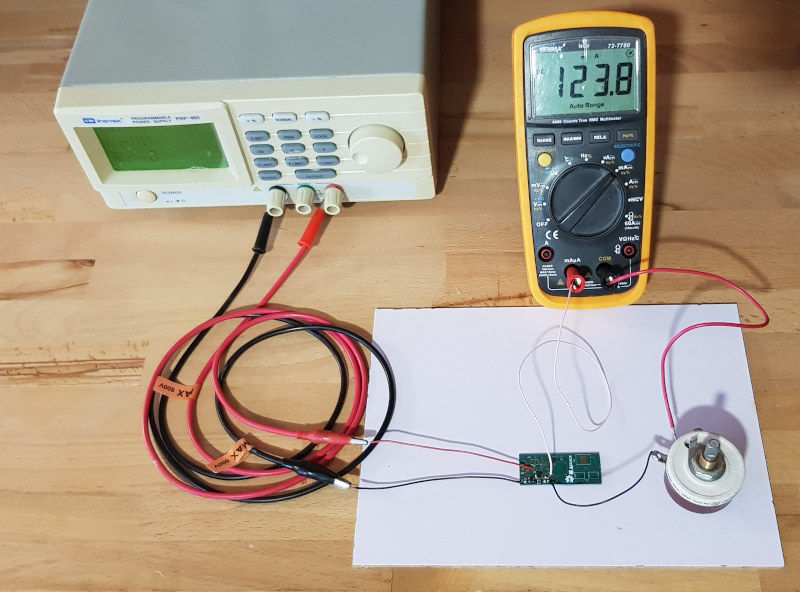
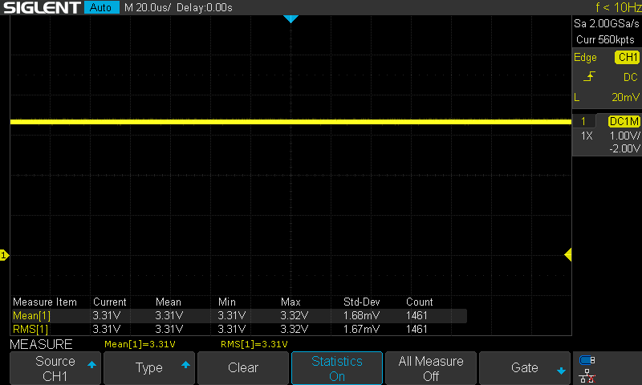
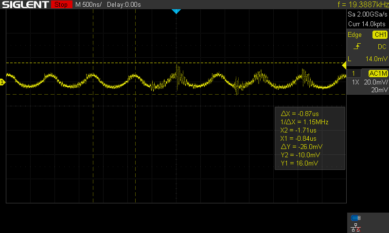
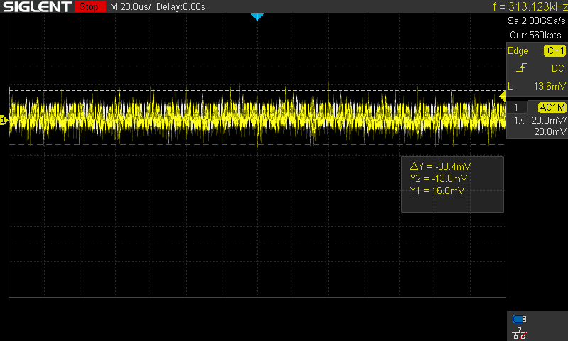
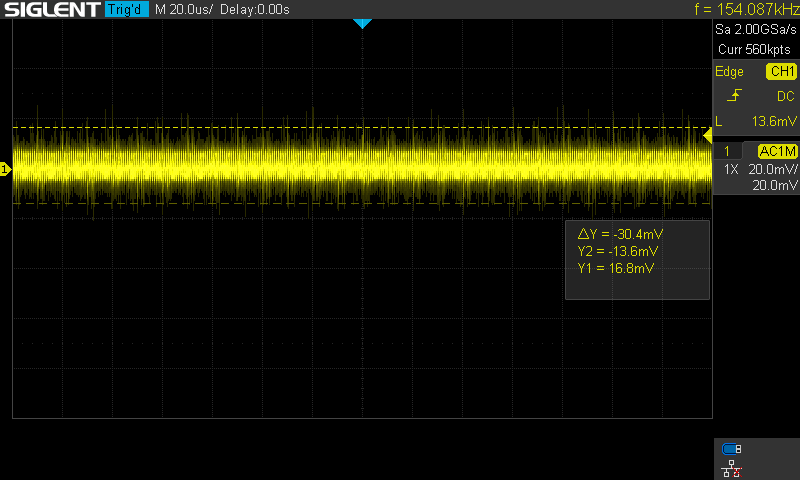
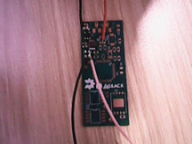
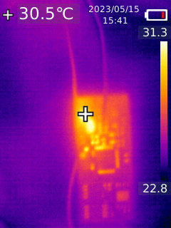

Test of MT3410 power supply
===========================

The goal of this test is to check performance of the MT3410 power supply
used into board rev2.

For this test, a board has been mounted with power supply only. The input has
been connected to a 5V regulated power supply, and for the load a variable
resistance has been connected on output.

Measures
--------

<table>
<tr><td><b>U In</b></td><td><b>I In</b></td><td><b>U Out</b></td><td><b>IOut</b></td>  <td><b>Ripple Out</b></td></tr>
<tr><td>5,00</td> <td>86 mA</td><td>3,34</td><td>120,9 mA</td><td>20mV @ 1,15MHz</td></tr>
<tr><td>5,00</td><td>106 mA</td><td>3,32</td><td>150,1 mA</td><td>22mV @ 1,15MHz</td></tr>
<tr><td>5,00</td><td>141 mA</td><td>3,31</td><td>198,9 mA</td><td>26mV @ 1,15MHz</td></tr>
<tr><td>5,00</td><td>179 mA</td><td>3,32</td><td>251,8 mA</td><td>27mV @   ''   </td></tr>
<tr><td>5,00</td><td>212 mA</td><td>3,31</td><td>298,2 mA</td><td>&nbsp;</td></tr>
<tr><td>5,00</td><td>249 mA</td><td>3,31</td><td>349,3 mA</td><td>&nbsp;</td></tr>
<tr><td>5,00</td><td>289 mA</td><td>3,30</td><td>403,4 mA</td><td>&nbsp;</td></tr>
<tr><td>5,00</td><td>324 mA</td><td>3,29</td><td>449,5 mA</td><td>&nbsp;</td></tr>
<tr><td>5,00</td><td>362 mA</td><td>3,28</td><td>502,0 mA</td><td>&nbsp;</td></tr>
</table>

<table>
<tr>
<td></td>
<td></td>
</tr><tr>
<td>Fig2: Output with 200mA load</td>
<td>Fig3: Noise with 100mA load</td>
</tr>
<tr>
<td></td>
<td></td>
</tr><tr>
<td>Fig4: Noise with 300mA load</td>
<td>Fig5: Noise with 400mA load</td>
</tr>
</table>

Thermal test
------------

A quick thermal verification has been made. Below picture has been taken
after 15 minutes at 200mA (T amb ~19°C). A more complete and documented
thermal test should be made (but not yet planned)

<table>
<tr>
<td></td>
<td></td>
</tr><tr>
<td>Fig6: Camera view</td>
<td>Fig7: IR view</td>
</tr>
</table>

Conclusion
----------

The new regulator ic MT3410 seems to be ok for the needs of cowstick-ums.