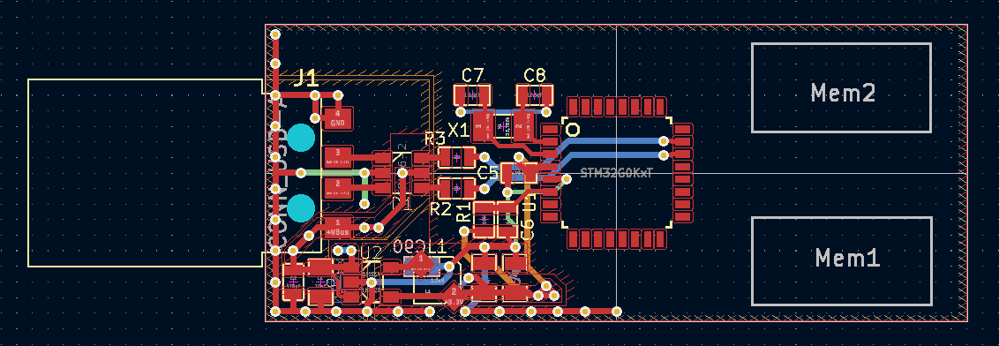

UMS usbkey
==========

The goal of this usb-key is to offer a versatile and customisable mass storage
device. It is *not* desined for very large storage capacity or high throughput
but offer a simple solution to create a storage device with custom features.
This device is part of cowstick boards family.

