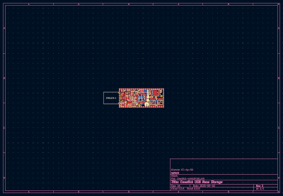

Cowstick UMS
============

The goal of this usb-key is to offer a versatile and customisable mass storage
device. It is *not* desined for very large storage capacity or high throughput
but offer a simple solution to create a storage device with custom features.
This device is part of cowstick boards family.

CAD sources
-----------

This board has been designed using KiCad EDA (version 6). All sources files
(schematics, routing, ...) are available into the `hardware` folder.

<table>
<tr>
<td></td>
<td></td>
</tr><tr>
<td>Fig1: Preview of the KiCad schematics</td>
<td>Fig2: Preview of the KiCad routing</td>
</tr>
</table>

License
-------

This project is OpenHardware. The hardware stugg is published under terms of
the Creative Commons ShareAlike license (CC-by-SA) see hardware/License.md.
The embedded firmware is published under terms of the GNU Lesser General Public
License (LGPL) version 3 see firmware/License.md.
